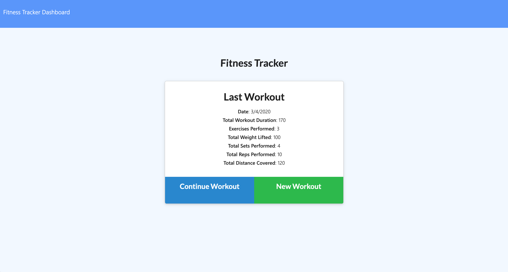

# Workout Tracker

An application that allows you to view, create and track daily workouts.


## Screenshot of Application



## Live Link
- Launch the application [here](https://hidden-oasis-60109.herokuapp.com/)

## Instructions for local install

Initialize with required npm packages using this command:

```sh
npm install
npm run seed
npm start
```

## Technologies Used
- HTML5
- CSS3
- JavaScript
- Express
- Node.js
- MongoDB
- Mongoose

## Features
- View, create and track daily workouts
- Log multiple exercises in a workout on a given day
- Track the name, type, weight, sets, reps, and duration of exercise
- If the exercise is a cardio exercise, track your distance traveled

## User Story
- As a person who exercises a lot
- I want a way to document my workout plan
- and edit my workout plan later

## Acceptance Criteria 1
- Given that the user loads the page
- they should be given the option to create a new workout
- or continue with their last workout

- - -
© 2020 [Madeline Jimenez](https://github.com/mijimenez)